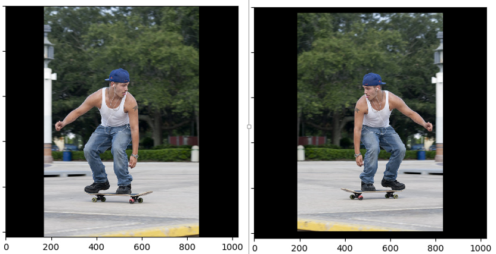

# Mask R-CNN for Human Pose Estimation

## Note
- This code has not been cleaned, and still may be difficult to read.
- The evaluation part has not been tested, it may come to crash in test mode.

## Configuration
- Please refer to the original version [matterport/Mask_RCNN](https://github.com/matterport/Mask_RCNN) to set up the environments.
- Modify the keras code in lines 2552-2353 of evaluate_generator() in the file /engine/training.py: averages.append(np.average([out[i] for out in all_outs], weights=batch_sizes, axis=0)). Or you can update the loss code as recently updated in [matterport/Mask_RCNN](https://github.com/matterport/Mask_RCNN/commit/e41ee4970764a302b6798a5762321a9eb9ae4eca)

## Pitfalls
- When using the horizontal flip augmentation, be aware of the "mirror person" problem. Maybe we should not use this kind of augmentation.

## Related Works
- [RodrigoGantier/Mask_R_CNN_Keypoints](https://github.com/RodrigoGantier/Mask_R_CNN_Keypoints)
- [Superlee506/Mask_RCNN_Humanpose](https://github.com/Superlee506/Mask_RCNN_Humanpose) It has a more efficient space encoding scheme when calculating the kp mask loss.
